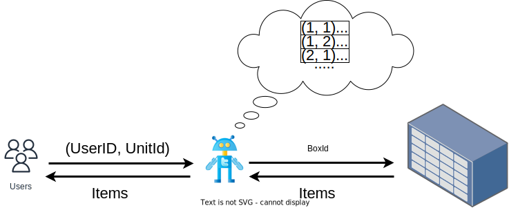

---

## Perspectives of Data

* A Programmer's Perspective on Data
* Programming Language Perspective
* Hardware Perspective
* Operating System Perspective

----

### A Programmer's Perspective on Data

* Data = variables
* Operations: declare/read/write
* Variables are stored in memory, so depending on the language, you can also:
    * allocate memory
    * deallocate memory

----

### Example

`demo/variables/c_vars.c`

----

### Performance: Depends on ...

* number of memory copies
    - `demo/performance/copy.c`
* degree of reuse of memory
    - `demo/performance/reuse.c`
* number of memory allocations/deallocations
    - `demo/performance/alloc.c`
    - `demo/performance/alloc.c`
* [Quiz](quiz/alloc.md)
* cache friendliness of the program's behavior
* hardware specifics

----

### Space usage: Depends on ...

* how we store data
    - use appropriate types for variables
        - `demo/space_usage/types.c`
    - `#pragma pack(1)`
        - `demo/space_usage/pragma.c`
    - union
        - demo/space_usage/union.c
* how soon memory is freed

----

### Security

* Buffer overflow
    - `demo/security/bo.c`
* NUL-terminated strings
    - `demo/security/nts.c`
* Integer overflow
    - `demo/security/io.c`

----

### Trade-offs

* Python - performance for security, ease of use
* D - can switch between both worlds

----

### Example

* Python
    - `demo/variables/d_vars.d`
* D
    - `demo/variables/python_vars.d`
* [Quiz](quiz/pl.md)

----

### Who manages memory?

* You (the programmer) - C/C++, D
* The programming language - Python, Java, D, Rust
* A library implementation - C/C++, D
* The operating system - for all languages

---

### Stages of data

---

### Programming Language Perspective

---

### Hardware perspective

----

### Hardware Perspective

----

### How is it Mapped?

---

### Operating System Perspective

----

### Storage Units - v1

----

### Storage Units - v1

* Each user needs to manually verify that a storage box is free
* The user needs to know the exact id of the box
* Extra security measures need to be implemented so that a user
does not end up opening another users box
* We expect the users to govern the situation
* Users = programs, storage unit = memory

----

### Storing Units - v2

----

### Storage Units - part 2

* An automated system handles the requests and assigns each user a `userId` and a virtual `unitId`
* The system assigns a physical box to each pair of (`userId`, `unitId`)
* Each user will start counting its units from 0 to N
* The user does not handle physical boxes

----

### Storing Memory

* How do computers use memory?
    - v1 or v2?
    - `demo/proc_storage/`